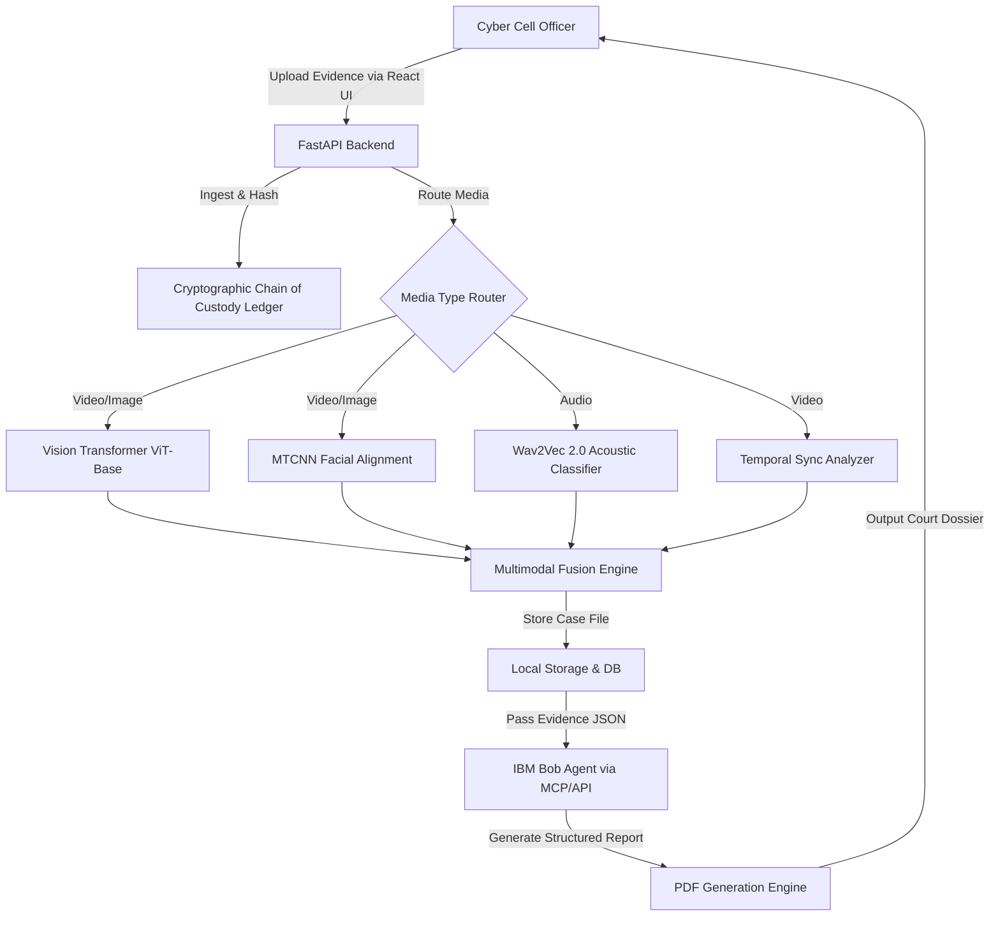

# Architecture Overview — DeepFake ForensicAI

## Component Architecture

## Component Table

| Component | Technology | Responsibility |
| --- | --- | --- |
| **Frontend UI** | React 18, TypeScript, Vite | Presents evidence, heatmaps, and allows officers to interact with the system. |
| **Backend API** | FastAPI, Python | Routes requests, orchestrates model inference, and manages state. |
| **Visual Models** | PyTorch, HuggingFace ViT | Extracts spatial tokens and calculates 12-layer attention heatmaps. |
| **Audio Models** | PyTorch, Wav2Vec 2.0 | Analyzes 16kHz audio for latent text-to-speech anomalies. |
| **Chain of Custody** | SHA-256 Hashing | Creates an immutable ledger linking ingestion, processing, and reporting. |
| **IBM Bob Agent** | watsonx.ai / IBM Bob | Synthesizes technical metrics into a court-admissible legal report mapping to IT Act/BNS. |

## End-to-End Data Flow

1. **Ingestion & Hashing**: An officer uploads a video file. Immediately, SHA-256 hashes are generated and recorded in the custody ledger.
2. **Extraction & Alignment**: The video is split into frames and an audio track. MTCNN detects faces and aligns them.
3. **Inference**: Frames are passed to the Vision Transformer; audio is passed to Wav2Vec 2.0. Grad-CAM heatmaps are generated for visual explainability.
4. **Fusion**: A deterministic fusion engine weighs the primary model probabilities against supporting heuristics.
5. **Reporting**: The final evidence package (JSON) is sent to IBM Bob, which uses its LLM capabilities to draft a narrative expert opinion.
6. **Export**: A 19-section PDF report is generated, complete with the final hash digest, for court submission.

## Security & Scalability Notes

- **Security**: The system enforces a strict Cryptographic Chain of Custody. Any alteration to the evidence on disk or the database will invalidate the hash chain, maintaining legal admissibility under Federal Rule of Evidence 901/902.
- **Scalability**: The backend is designed for CPU-first execution but auto-detects CUDA for GPU acceleration. For high-throughput scenarios, inference tasks can be decoupled via Celery/Redis workers.
- **Fail-Soft LLM**: If the IBM Bob API is unreachable, the system gracefully degrades, allowing officers to view raw AI metrics and export manual reports.
